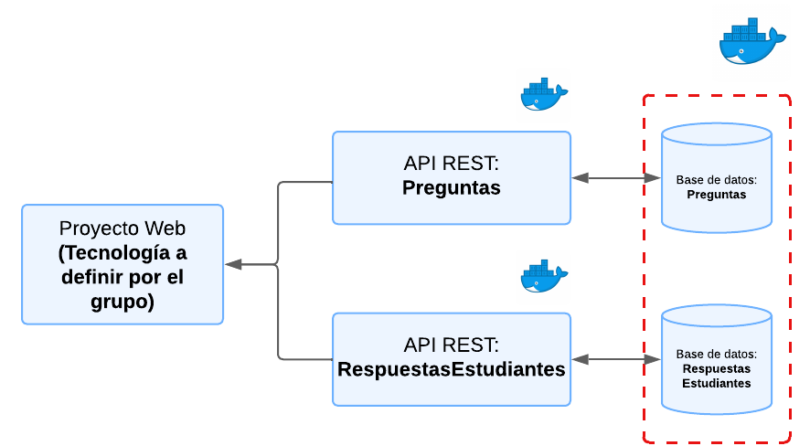

# Grupo x

Este es el repositorio del grupo x, cuyos integrantes son:

- Integrante 1 - ROL:
- Integrante 2 - ROL:
- Integrante 3 - ROL:
- Integrante 4 - ROL:
    - **Tutor**: Tutor

# [NUEVO] INF236-2025-1-Proyecto Base

## Aspectos técnicos relevantes

_Todo aspecto relevante cuando para poder usar el proyecto o consideraciones del proyecto base a ser entregado_

_Nada por el momento..._

## Requerimientos

Para utilizar el proyecto base debe tener instalado [Node.js](https://nodejs.org/en), [Docker](https://www.docker.com/) y se recomienda [Postman](https://www.postman.com/) para poder probar los endpoints de las APIs.

## Puntos a Considerar
La solución a desarrollar debe seguir los siguientes lineamientos (imagen referecial al final):
* Se debe considerar dos API's:
    * **API_PREGUNTAS:** Con todo lo referido a las preguntas de los ensayos.
    * **API_RESPUESTASESTUDIANTES**: Con todo lo referido a las respuestas de los estudiantes a cada pregunta.
* Cada API contará con una base de datos mysql.
* Las API's deben ser construidas utilizando [Node.js](https://nodejs.org/en), además cuentan con [Express](https://expressjs.com/es/) para facilitar la construcción de estas.
* Las bases de datos deben estar en el mismo contenedor, pero no deben compartirse servicios.
* Cada servicio debe estar en un contenedor.
* El proyecto base solo considera los servicios.
* La tecnología de Frontend la define el grupo.


## Levantando el proyecto
### API_Ejemplo
Iniciaremos levantando la imagen de mysql en docker junto con la API de ejemplo. En una terminal dentro de la **carpeta principal**, escriba el siguiente comando:
```
docker compose up --build
```
La base de datos se inicializará con una tabla con información de países especificada en el archivo "API_EJEMPLO/init/init.sql".

Deben esperar a que los contenedores se inicien en su totalidad, pueden verificar esto en la interfaz de Docker. Luego, podrán probar los endpoints de la API, estos son:
```
GET: localhost:8082/api/pais
POST: localhost:8082/api/pais
PUT: localhost:8082/api/pais/:id
DELETE: localhost:8082/api/pais/:id
```
Sirven para leer, crear, modificar y eliminar registros de la base de datos, respectivamente.

> ⚠️ Cuando escriban ``docker compose up --build``, es normal que aparezcan errores al principio en la terminal. Esto pasa porque la API necesita conectarse a la base de datos. Si bien Docker levanta la BD y luego la api, la primera se levanta mucho más lento que la api! Así que la api lanza errores mientras espera que la base de datos esté lista. Es decir, no entren en pánico y esperen que diga: "Server running!"

### Configuración del Proyecto
Para el desarrollo del proyecto pueden quitar la API Ejemplo del archivo "docker-compose.yml" y eliminar su contenedor. **Noten que el proceso descrito a continuación levanta los contenedores uno a uno. Si lo desean, pueden investigar como juntar todo en el mismo docker-compose (como la API_EJEMPLO y la BD)!**

#### Bases de Datos
Para comenzar, deben tener ejecutándose el contenedor de la base de datos creado con la api de ejemplo, o pueden crearlo desde cero con el comando:
```
docker run -p 3306:3306 --name mysql -e MYSQL_ROOT_PASSWORD=password -d mysql
```


Ahora, crearemos las bases de datos. Para esto debemos entrar en el contenedor, con el siguiente comando:
```
 docker exec -it proyecto-base-mysql-1 mysql -uroot -p
```
Donde "proyecto-base-mysql-1" es el nombre del contenedor. Si no les coincide pueden revisarlo con "docker ps". Luego, deben ingresar la clave que en este caso es: **password**.

Una vez dentro del contenedor podemos crear las bases de datos:
```
create database Nombre;
```
Donde Nombre, deberá ser sustituido por: BDXX_PREGUNTAS y BDXX_RESPUESTASESTUDIANTES, donde XX corresponde al número de su grupo.

### API's
#### API_PREGUNTAS
Se debe editar el archivo con nombre ".env" que se encuentra en las carpetas "API_PREGUNTAS". Este debería contener lo siguiente:
```js
PORT_API = 8080
DB_USER = "root"
DB_PASSWORD = "password"
DB_NAME = "Nombre de la base de datos"
DB_PORT = 3306
DB_HOST = "host.docker.internal"
```
Deben cambiar DB_NAME por el nombre que le pusieron a la base de datos (BDXX_PREGUNTAS).

Una vez creado el archivo, se levantará el contenedor de la API. Primero deben entrar en la carpeta de "API_PREGUNTAS" y escribir:
```
docker compose up --build -d
```

#### API_RESPUESTASESTUDIANTES
Los pasos a seguir son los mismos, únicamente deben fijarse que ahora esta API correrá en el puerto "8081".
```js
PORT_API = 8081
DB_USER = "root"
DB_PASSWORD = "password"
DB_NAME = "Nombre de la base de datos"
DB_PORT = 3306
DB_HOST = "host.docker.internal"
```

Una vez levantado todo, deberían poder ver en Docker todos sus contenedores corriendo:


Pueden probar los siguientes end-points en Postman para verificarlo:
```
GET: localhost:8080/createTable
```


```
GET: localhost:8081/createTable
```


Además, pueden poner en su navegador ```localhost:8080``` y/o ```localhost:8081```, y les debería salir el siguiente mensaje:


### Enjoy!
